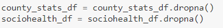
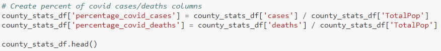

# ETL_Project

Problem Statement:
  The 2020 Presidential Election is often called ‘the election of our lifetimes’, and the voter turnout was in record numbers, even during a critical period where the United States is recording daily records for higher cases in COVID-19. The votes between the two main presidential candidates Donald Trump and Joseph Biden were closer than expected by most, and both candidates fought battles to take control of key battleground states. We want to create a relational database that shows how several key factors that were projected to play important roles in this election differed by county and state, including the number of COVID-19 cases and deaths, percentage of citizens with no health insurance, and percentage of citizens with no high school diplomas. 

  In order to understand voter preference - we compiled a relational database that is sourced from two separate datasets found on Kaggle. One dataset titled, “county_statistics”, explores the 2020 election/voter demographic in relation to the COVID pandemic. Our other dataset, “us_county_sociohealth_data”, looks at COVID in regards to socioeconomic conditions. Both data sources were formatted as CSVs. We imported this data into Python, using the Pandas library and interfaced using a jupyter notebook, to perform some data cleaning and manipulation tasks. Once our data was clean, we exported into PostgreSQL and interfaced using pgAdmin to update the tables we created.	Our data cleaning steps are outlined as follows:

We dropped all columns and formatted the following columns into a Pandas dataframe:

  We then extracted which columns from our original data sources to use in our relational database. Next we used Quick DataBase Diagrams to visualize our relational database and set our primary key, composite key, and foreign key for unique identification. The composite key consists of ‘county’ and ‘state’ in the county_statistics dataset, and acts as reference for the ‘county’ and ‘state’ foreign keys in the county_socioheath_data dataset. The ‘fips_code’ column in county_sociohealth_data was given the primary key. We then exported the schemas onto a sql file unedited_query_tables.sql.

  We chose this schema because we felt that structuring the data in this way presented data that provided users with noteworthy factors that could potentially influence the outcome of the 2020 election. It’s worth mentioning that Quick Database Diagrams does not have a method to visual composite keys, so instead we created two primary keys and connected them to foreign keys for visualization purposes. We changed this by manually editing the sql file to show a composite key, which was then renamed to edited_query_tables.sql.

We performed the following data **__transformations__** in Python:

- **Dropping null values** (Null values skew trends. An option would be to replace these N/As with linear regression values, but because there was not much data loss - we opted to drop them completely)

- **Created columns to display the percentage of covid cases & deaths** (We found this data to be more representative of what we wanted to convey in our relational database)

- **Deleted the cases/deaths columns** (Columns were no longer needed)

- **Renamed/rearranged columns to match the PostgreSQL database** (Column headers needed to be exact matches for tables to be updated)

- Using a dictionary’s key-value pairs, we **renamed state abbreviations to full names**. We also used a **for-loop in the form of list comprehension to change these values** (Both CSV did not have consistent naming for the states, so this dictionary serves to bridge those discrepancies)

- Index was reset for both data frames after performing the data manipulation task. **We created two new dictionaries using the county as the key and appended the states to them**. (This task was done using multiple for loops, checking if those county names existed in each dataset and providing the full state name if found)

- We then **created a blank dictionary called mutual_counties**. This dictionary used key-value pairings from both data frames and produced any matches into a list: mutual_counties. We then used mutual_counties to and appended states that were in both data frames. Finally we then cleaned both data frames by deleting rows that did not have county or states values listed in their columns:

After performing our data manipulation/transformations we wanted to **__load__** the transformed data into our relational database. We now took our clean Pandas dataframes and created a connection to our local PostgreSQL server. Using the SQLAlchemy library we imported create_engine to create the connection - inputting our PostgreSQL username, password, the IP of the where the server was run (local machine), port(5432), and database name(county_db):

We then ran the following method to verify a connection was established with the server:

Once verified, we used Pandas to load the data frame into our PostgreSQL server:

Finally we verified the data was appended to our tables in our PostgreSQL server by checking the tables within the server itself and confirmed the server updates within our Python script by running the pd.read_sql_query Pandas method. 

Data Sources:

1. A CSV file containing US 2020 Presidential Election Results by county and state, along with the number of COVID-19 cases and deaths. URL: https://www.kaggle.com/etsc9287/2020-general-election-polls?select=county_statistics.csv

2. A CSV file with different factors expressed in percentages to show how each county in the United States is affected by lack of health insurance, lack of education, and the number of COVID-19 cases as well as other factors. URL:   https://www.kaggle.com/johnjdavisiv/us-counties-covid19-weather-sociohealth-data?select=us_county_sociohealth_data.csv
